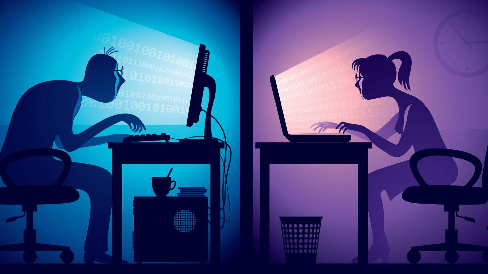

# Riesgos Laborales 

---

Aquí detallarás los riesgos más comunes que enfrentan los profesionales informáticos. Algunos ejemplos incluyen:

- Riesgos ergonómicos: Posturas incorrectas, uso prolongado de ordenadores, mobiliario inadecuado.
- Riesgos psicológicos: Estrés, carga laboral excesiva, fatiga mental.
- Riesgos eléctricos: Manejo de cables y equipos defectuosos.
- Riesgos ambientales: Iluminación inadecuada, ruido, temperatura extrema.
- Riesgos asociados a la seguridad informática: Acceso a datos confidenciales, exposición a ciberataques.

Uno de los riesgos más destacados en el ámbito informático es el ergonómico. Los trabajadores pasan largas horas frente a una pantalla, lo que puede causar problemas de visión, dolores musculares y trastornos en la columna vertebral. 
Además, la exposición constante al estrés puede derivar en problemas psicológicos que afectan tanto la productividad como la salud personal.
